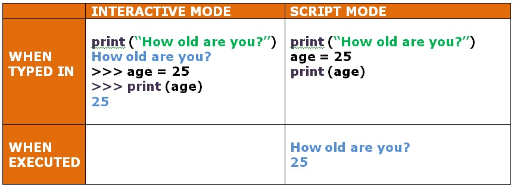
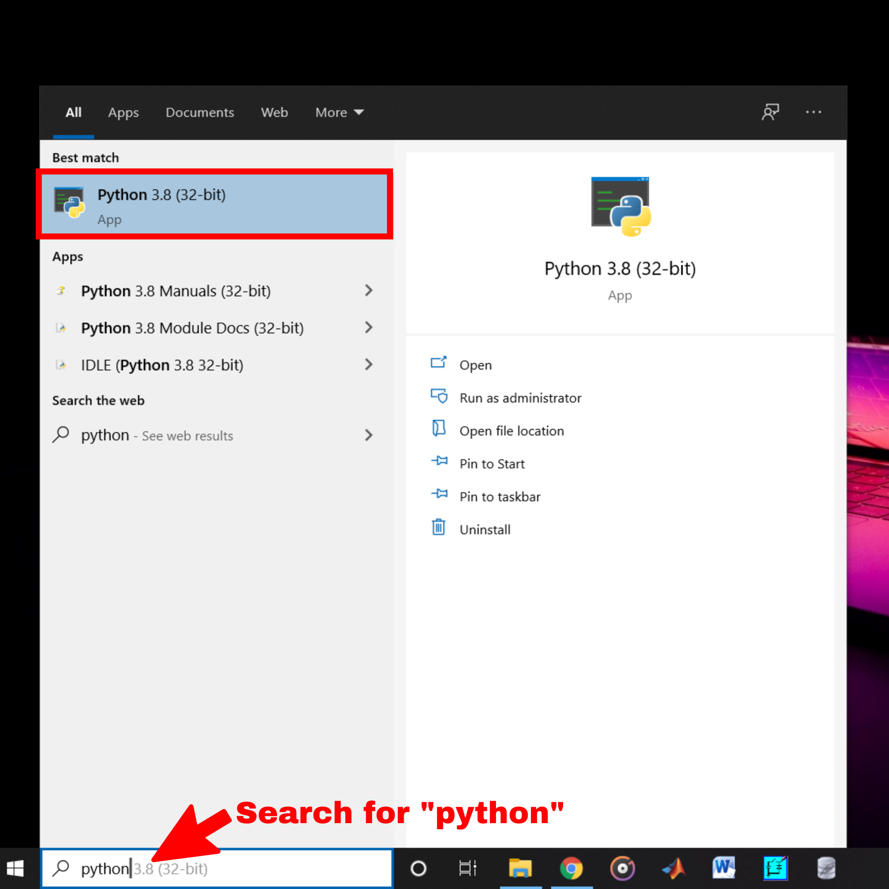
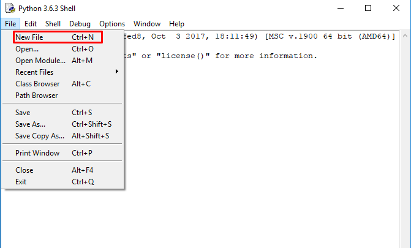
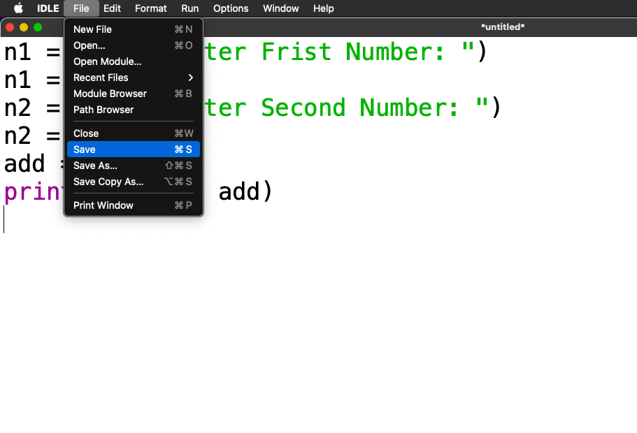
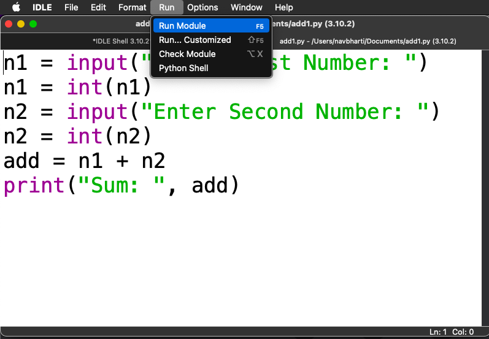
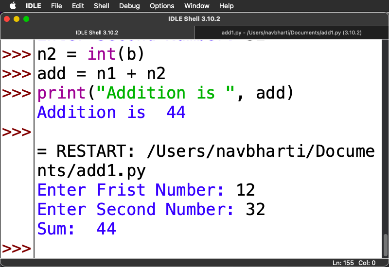
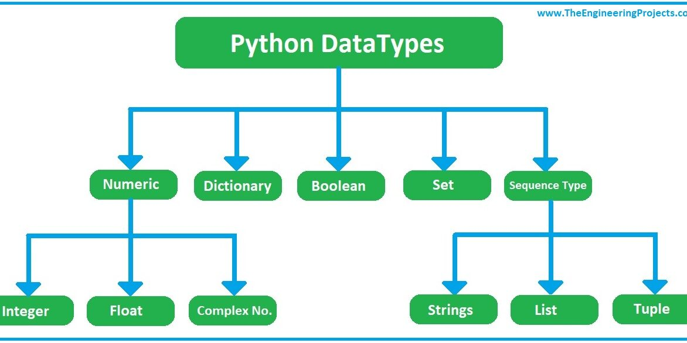
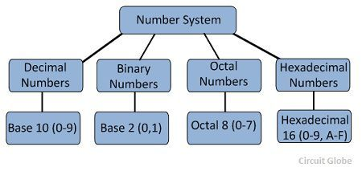

# Session Two: Introductiont to Python

`Python` is a `general-purpose`, `high level programming language`, `object-oriented programming language` created by `Guido van Rossum` in `1991` and further developed by the `Python Software Foundation`. It is also called `general-purpose programming language` that is designed for a code readability, and possible to write bigger program in fewer lines of code. There are two major Python versions: `Python 2` and `Python 3`. Both are quite different.



## Interactive Mode of Execution

Basic Operations in Interactive Mode
```python
>>> print("Hello World")
Hello World
>>> 3 + 5
8
>>> 3 - 5
-2
>>> 3 * 5
15
>>> 3 / 5
0.6
>>> 12 % 5
2
```

Create Variable in Python

```python
>>> a = 3
>>> print(a)
3
>>> b = 5
>>> print(b)
5
>>> a
3
>>> b
5
>>> a + b
8
>>> a - b
-2
>>> a * b
15
>>> a / b
0.6
>>> c = 12
>>> c % 5
2

>>> a = input()
12
>>> b = input()
20
>>> a
'12'
>>> b
'20'
>>> a + b
'1220'
>>> a - b
Traceback (most recent call last):
  File "<pyshell#50>", line 1, in <module>
    a - b
TypeError: unsupported operand type(s) for -: 'str' and 'str'
>>> n1 = int(a)
>>> n2 = int(b)
>>> n1
12
>>> n2
20
>>> n1 + n2
32
>>> n1 - n2
-8
>>> n1 * n2
240
>>> n1 / n2
0.6
>>> n1 % n2
12
```
Program to read two Integer values and print the sum.
```python
>>> a = input("Enter First Number: ")
Enter First Number: 12
>>> n1 = int(a)
>>> b = input("Enter Second Number: ")
Enter Second Number: 32
>>> n2 = int(b)
>>> add = n1 + n2
>>> print("Addition is ", add)
Addition is  44

```

## Scripting Mode of Execution

1. open IDLE

2. create new file from File Menu

3. Type python code in the file
```python
a = input("Enter First Number: ")
n1 = int(a)
b = input("Enter Second Number: ")
n2 = int(b)
add = n1 + n2
print("Resutl is ", add)
```
4. Save the file with .py extension

5. Run the code using option `Run Module` in `Run` menu



## Datatype in Python
1. int
2. float
3. string
4. complex
5. list
6. tuple
7. set 
8. dictionary



## 1. Interger Datatype in Python


Creating Integer Variable
```python
>>> d = 10 #base-10 integer
>>> print(d)
10
>>> b = 0b1011 #base-2 integer
>>> print(b)
11
>>> o = 0o75 #base-8 integer
>>> print(o)
61
>>> h = 0xF2A #base-16 integer
>>> print(h)
3882

```
Integers can be binary, octal, and hexadecimal values.

Leading zeros in non-zero integers are not allowed e.g. 000123 is invalid number, 0000 is 0.

Use underscore _ as a delimiter instead.
```python
>>> x=1_234_567_890
>>> x
1234567890
```

Writing Comment in Python Program
```python
#Hash symbol is used to write one liner comment

'''
three consequtive single quotation opening 
and three consequtive single  quotation closing 
is used for multiline comment.
'''


"""three consequtive single double quotation opening 
and three consequtive single double quotation closing 
is used for multiline comment.
"""
```

### Base Conversion in Python
```python
>>> bin(10) #base-10 integer to base-2 integer conversion
'0b1010'
>>> bin(0o75) #base-8 integer to base-2 integer conversion
'0b111101'
>>> bin(0xF2A) #base-16 integer to base-2 integer conversion
'0b111100101010'
>>> oct(10) #base-10 integer to base-8 integer conversion
'0o12'
>>> oct(0b1111) #base-2 integer to base-8 integer conversion
'0o17'
>>> oct(0xf2a) #base-16 integer to base-8 integer conversion
'0o7452'
>>> hex(116) #base-10 integer to base-16 integer conversion
'0x74'
>>> hex(0b111101101101) #base-2 integer to base-16 integer conversion
'0xf6d'
>>> hex(0o7563) #base-8 integer to base-16 integer conversion
'0xf73'

```
NOTE: Python2 has int as well as long datatype. The range of int datatype in python2 is [-2^31 to 2^31 - 1] and there is no limitation of max value in case of long datatype in python2. In Python3, value of an integer is not restricted by the number of bits and can expand to the limit of the available memory.

## 2. Float Datatype in Python

floating point numbers (float) are positive and negative real numbers with a fractional part denoted by the decimal symbol . or the scientific notation E or e, e.g. 1234.56, 3.142, -1.55, 0.23.

Floats can be separated by the underscore _, e.g. 123_42.222_013 is a valid float.

Floats has the maximum size depends on your system. The float beyond its maximum size referred as "inf", "Inf", "INFINITY", or "infinity". Float 2e400 will be considered as infinity for most systems.

## 3. String Datatype in Python
```python 
>>> s1 = "Hello World"
>>> type(s1)
<class 'str'>
>>> s2 = 'Hello World'
>>> type(s2)
<class 'str'>
>>> s3 = "Ram's Book"
>>> print(s3)
Ram's Book
>>> s3
"Ram's Book"
>>> s4 = 'Ram"s Book'
>>> s4
'Ram"s Book'
>>> print(s4)
Ram"s Book

```
### Controlling fractional digits in floating point number

```python
>>> f = 3.123456789
>>> f
3.123456789
>>> print(f)
3.123456789
>>> fround = round(f, 2)
>>> fround
3.12
>>> print(fround)
3.12

>>> f_limited = "{:.2f}".format(f)
>>> f_limited
'3.12'
>>> print(f_limited)
3.12

```
## 4. Complex Datatype in Python

A complex number is a number with real and imaginary components. For example, 5 + 6j is a complex number where 5 is the real component and 6 multiplied by j is an imaginary component.

```python
>>> a=5+2j
>>> a
(5+2j)
>>> type(a)
<class 'complex'>
```
### Arithmetic Operations on Complex Numbers

```python
>>> a=6+4j
>>> a+2
(8+4j)
>>> a*2
(12+8j)
>>> a/2
(3+2j)
>>> a**2
(20+48j)
>>> b=3+2j
>>> a+b    
(9+6j)    
>>> a-b    
(3+2j)

>>> a=6+4j
>>> b=3+2j
>>> a+b    
(9+6j)    
>>> a-b    
(3+2j)
>>> a*b    
(10+24j)

>>> a=6+4j             
>>> b=3+2j             
>>> c=a*b              
>>> c=(6+4j)*(3+2j)    
>>> c=(18+12j+12j+8*-1)
>>> c=10+24j
```
Read more about Complex Number System [here](https://byjus.com/maths/complex-numbers/).

Application of Complex Number [here](https://www.ukessays.com/essays/engineering/application-and-use-of-complex-numbers-engineering-essay.php).