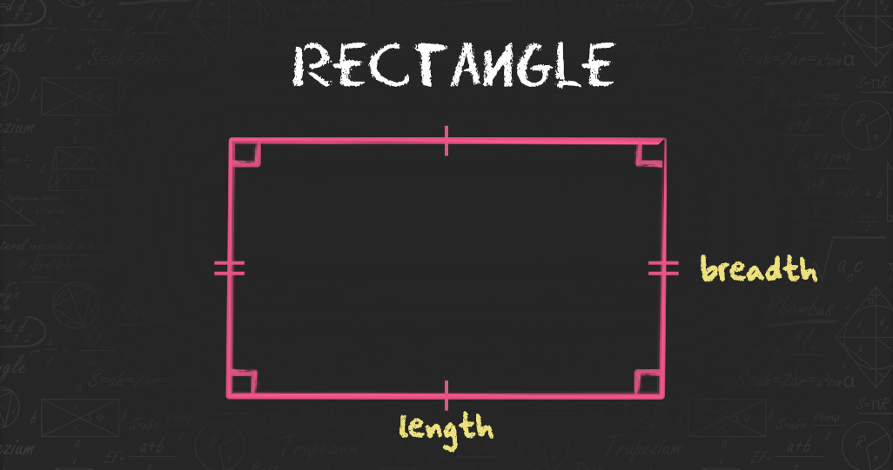

# Session Three: conditional (if), alternative (if-else), chained conditional (if-elif-else)

## Mensuration Implementation is Python

`Mensuration` is the branch of geometry that deals with the measurement of `area`, `length`, or `volume` in 2D and 3D shapes. The 2D shapes can be drawn in a plane like square, rectangle, triangle, circle, etc. and 3D shapes cannot be represented in a plane like bricks, ice-cream cones, football, etc. Mensuration includes computation using `mathematical formulas` and `algebraic equations`. 

### 2D Shapes and Formula


1. Circle


```python
Diameter of a Circle = 2 × Radius

Circumference of a Circle = π × Diameter or 2 × π × Radius

Area of a Circle = π × Radius x Radius
```
2. Rectangle



```python
Perimeter of a Rectangle = 2 x (Length + Breadth)

Area of a Rectangle = Length × Breadth
```

3. Square


```python
Area of a Square = Side x Side

Perimeter of a Square = 4 x Side
```

4. Triangle


```python
Area of a Triangle = ½ × b × h
```

5. Pentagon


6. Hexagon


7. Parallelogram


```python
Perimeter of a Parallelogram = 2 (a+b)

Area of a Parallelogram = b × h
```

### 3D Shapes and Formula


1. Cube


```python
Volume of a Cube = Side3 cubic units.

Lateral Surface Area of a Cube= 4 × side2 sq.units.

Total Surface Area of a Cube= 6× side2 sq. units.
```

2. Cuboid


```python
Volume of a Cuboid = (length+width+height) cubic units.

Lateral Surface Area of a Cuboid = 2×height (length + width) sq. units.

Total Surface Area of a Cuboid = 2(length × width + length × height + height × width) sq.units.

Diagonal length of a Cuboid = length2 + breadth2 + height2 units. 
```

3. Cylinder


4. Pyramid
5. Triangle Prism
6. Cone


```pyhon
Volume of a Cone = 1/3 × × π × radius² × height cubic units. 

Total Surface Area of the Cone = πr(l + radius)
```

7. Shpere


```python
Volume of a Sphere = 4/3 x π x radius³ cubic units.

Surface Area of a Sphere = 4x π x radius² sq. units.
```


Read more about Geometrical Shapes [here](https://byjus.com/maths/mensuration/).