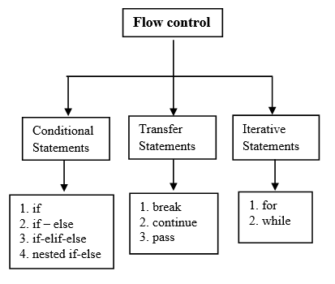
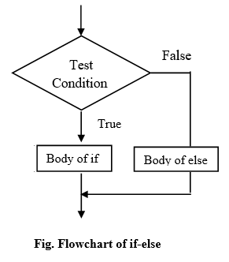

# Session Four: Control Flow Statement: Iteration: state, while, for, break, pass




## 1. Conditional Statement
### 1. Sim;ple if Statement


The `Simple if statement` is the simplest form. It takes a `condition` and evaluates to either `True` or `False`. 

If the condition is `True`, then the `True block` of code will be executed, and if the condition is `False`, then the `block of code is skipped`, and The controller moves to the next line

### Syntax:

```python
if condition:
     statement 1
     statement 2
     statement n
```

`NOTE`: The `block of code` is represented by `Indentation`. Indentation if collection of space or tab.

`Example`: Read an integer value and print the value is Greater than 10 if the input value is greater than then.

```python
strVal = input("Enter a Number: ")
n = int(strVal)
if n > 10:
    print("Greater than 10")
print("Outside of if block")
```


### 2. if-else Statement



The `if-else statement` checks the condition and `executes the if block` of code when the condition is `True`, and if the condition is `False`, it will `execute the else block` of code.

## Syntax: 

```python
if condition:
    statement 1
else:
    statement 2
```

`Example`: Write a python program to read an integer value and print the integer is Even of Odd.

```python
strVal = input("Enter a Number: ")
n = int(strVal)
if n % 2 == 0:
    print("Even")
else: 
    print("Odd")
print("Outside if-else")
```

### 3. if-elif-else Ladder/Chaining Statement


The `elif statement` checks multiple conditions one by one and if the condition fulfills, then executes that code. After executing matched condition it skips all other conditions checking.

This is useful when you need to check multiple conditions.

## Syntax:

```python
if condition-1:  
     statement 1 
elif condition-2:
     stetement 2 
elif condition-3:
     stetement 3 
     ...         
else:            
     statement 
```
`Example`: Write a python program to read a single digit integer and print its word form. 

```python
strVal = input("Enter a Number: ")
n = int(strVal)
if n == 0:
    print("Zero")
elif n == 1:
    print("One")
elif n == 2:
    print("Two")
elif n == 3:
    print("Three")
elif n == 4:
    print("Four")
elif n == 5:
    print("Five")
elif n == 6:
    print("Six")
elif n == 7:
    print("Seven")
elif n == 8:
    print("Eight")
elif n == 9:
    print("Nine")
else:
    print("Not a Sigle Digit Number")
print("Outside if-else")
```

### 4. nested if-else


`Nested if-else` statement is an `if statement inside another if-else statement`. It is allowed in Python to put any number of if statements in another if statement.

Indentation is the only way to differentiate the level of nesting. The nested if-else is useful when we want to make a series of decisions.

### Syntax:

```python
if conditon_outer:
    if condition_inner:
        statement of inner if
    else:
        statement of inner else:
    statement ot outer if
else:
    Outer else 
statement outside if block
```
Example: Write a python program to read three integers and print the Greates integer.

```python
val1 = input("Enter First Number: ")
a = int(val1)

val2 = input("Enter Second Number: ")
b = int(val2)

val3 = input("Enter Third Number: ")
c = int(val3)

if a > b:
    if a > c:
        print("First Number is the Greatest: ", a)
    else:
        print("Third Number is the Greatest: ", c)
else:
    if b > c:
        print("Second Number is the Greatest: ", b)
    else:
        print("Third Number is the Greatest: ", c)
```

Whenever we write a block of code with multiple if statements, indentation plays an important role. But sometimes, there is a situation where the block contains only a single line statement.

Instead of writing a block after the colon, we can write a statement immediately after the colon.

```python
number = 56
if number > 0: print("positive") 
else: print("negative")
```

## 2. Transfer Statement
### 1. break statement
### 2. continue statement
### 3. pass statements
## 3. Iterrative Statement
### 1. for loop


### 2. while loop


# CodeChef Practice Problem

[ATM](https://www.codechef.com/problems/HS08TEST) 

[Add Two Numbers](https://www.codechef.com/problems/FLOW001)

[Inormous Input Test](https://www.codechef.com/problems/INTEST)

[Sum of Digits](https://www.codechef.com/problems/FLOW006)

[Find Remainder ](https://www.codechef.com/problems/FLOW002)

[First and Last Digit](https://www.codechef.com/problems/FLOW004)

[Lucky Four](https://www.codechef.com/problems/LUCKFOUR)

[Reverse the Number](https://www.codechef.com/problems/FLOW007)

[Small Factorials](https://www.codechef.com/problems/FCTRL2)

[Turbo Sort](https://www.codechef.com/problems/TSORT)

[Finding Square Root](https://www.codechef.com/problems/FSQRT)

[Second Largest](https://www.codechef.com/problems/FLOW017)

[Small Factorial](https://www.codechef.com/problems/FLOW018)

[Chef and Operator](https://www.codechef.com/problems/CHOPRT)

[Helping Chef](https://www.codechef.com/problems/FLOW008)

[Valid Triangle](https://www.codechef.com/problems/FLOW013)

[Decrement and Increment](https://www.codechef.com/problems/DECINC)

[Chef and Remissness](https://www.codechef.com/problems/REMISS)

[Mahasena](https://www.codechef.com/problems/AMR15A)


# Exercise in List
1. Find Duplicate Values using Python

2. Sentence and Word Tokenization using Python


3. Count Length of a String using Python

4. Detect Questions using Python

5. Index of Maximum Value in a Python List

6. Index of Minimum Value in a Python List

7. For Loop Over Keys and Values in a Python Dictionary

8. Swap Items of a Python List

9. Backward For Loop using Python

10. LCM using Python

11. Age Calculator using Python

12. Python Program to Count Most Frequent Words in a File

13. Python Program to Count Capital Letters in a File

14. Python Program to Remove Spaces

15. Python Program to Remove Odd or Even Numbers From a List

16. End-to-End Encryption using Python


16. Remove Duplicates from a Python List

17. Sum of Elements of a Python List

18. Print a Calendar using Python

19. For Loop Over Two Lists in Python

20. Swap Variables using Python

21. Password Authentication using Python

22. Python Program to Print Odd and Even Numbers

23. Pick a Random Card using Python

24. Remove Unicode Characters using Python

25. Count Character Occurrences using Python

26. Create Acronyms using Python

27. Text-Based Adventure Game with Python

28. Create a Contact Book using Python

29. Palindrome Words using Python

30. Format Dates using Python


31. Python Program to Check Vowel

32. Dice Roll Simulator with Python

33. Multiple Inputs with Python using While Loop

34. Python Program to Convert Roman Numbers to Decimals


# List of Problems for Recursive Function in Python

1. Write a function in python to print first 50 natural numbers using recursion. 
```python
#Expected Output :

 1  2  3 4  5  6  7  8  9  10  11  12  13 14  15  16  17  18  19  20  21  22  23  24  25  26  27  28  29  30 31  32  33  34  35  36  37  38 39  40  41  42  43  44  45  46  47 48  49  50 
```

2. Write a function in python to calculate the sum of numbers from 1 to n using recursion.
```python
Test Data :
Input the last number of the range starting from 1 : 5
Expected Output :

The sum of numbers from 1 to 5 : 
15
```

3. Write a function in python to Print Fibonacci Series using recursion. 

```python
Test Data :
Input number of terms for the Series (< 20) : 10
Expected Output :

 Input number of terms for the Series (< 20) : 10                                
 The Series are :                                                                
 1  1  2  3  5  8  13  21  34  55  
```

4. Write a function in python to print the list elements using recursion. 
```python
Test Data :
Input the number of elements to be stored in the array :6
Input 6 elements in the array :
element - 0 : 2
element - 1 : 4
element - 2 : 6
element - 3 : 8
element - 4 : 10
element - 5 : 12
Expected Output :

The elements in the array are : 2  4  6  8  10  12 
```

5. Write a function in python to count the digits of a given number using recursion. 
```python
Test Data :
Input a number : 50
Expected Output :

The number of digits in the number is :  2
```

6. Write a function in python to find the sum of digits of a number using recursion. 
```python
Test Data :
Input any number to find sum of digits: 25
Expected Output :

The Sum of digits of 25 = 7 
 
```

7. Write a function in python to find GCD of two numbers using recursion. 
```python
Test Data :
Input 1st number: 10
Input 2nd number: 50
Expected Output :

The GCD of 10 and 50 is: 10 
```

8. Write a function in python to get the largest element of list using recursion.
```python
Test Data :
Input the number of elements to be stored in the array :5
Input 5 elements in the array :
element - 0 : 5
element - 1 : 10
element - 2 : 15
element - 3 : 20
element - 4 : 25
Expected Output :

Largest element of an array is: 25  
```

9. Write a function in python to print a string in reverse using recursion. 
```python
Test Data :
Input any string: w3resource
Expected Output :

The reversed string is: ecruoser3w   
```

10. Write a function in python to find the Factorial of a number using recursion. 
```python
Test Data :
Input a number : 5
Expected Output :

The Factorial of 5 is : 120
```

11. Write a function in python to convert a decimal number to binary using recursion. 
```python
Test Data :
Input any decimal number : 66
Expected Output :

The Binary value of decimal no. 66 is : 1000010    
```

12. Write a function in python to check a number is a prime number or not using recursion. 
```python
Test Data :
Input any positive number : 7
Expected Output :

The number 7 is a prime number.   
```

13. Write a function in python to find the LCM of two numbers using recursion. 
```python
Test Data :
Input 1st number for LCM : 4
Input 2nd number for LCM : 6
Expected Output :

The LCM of 4 and 6 :  12   
```

14. Write a function in python to print even or odd numbers in given range using recursion. 
```python
Test Data :
Input the range to print starting from 1 : 10
Expected Output :

All even numbers from 1 to 10 are : 2  4  6  8  10                              
All odd numbers from 1 to 10 are : 1  3  5  7  9   
```

15. Write a function in python to multiply two matrix using recursion. 

Note: use nested list for Matrix representation.
```python
Test Data :
Input number of rows for the first matrix : 2
Input number of columns for the first matrix : 1
Input number of rows for the second matrix : 1
Input number of columns for the second matrix : 2
Input elements in the first matrix :
element - [0],[0] : 1
element - [1],[0] : 2
Input elements in the second matrix :
element - [0],[0] : 3
element - [0],[1] : 4
Expected Output :

Here is the elements of First matrix :                                          
                                                                                 
 1                                                                               
 2                                                                               
 Here is the elements of Second matrix :                                         
                                                                                 
 3       4                                                                       
 The multiplication of two matrix is :                                           
                                                                                 
 3       4                                                                       
 6       8    
```

16. Write a function in python to Check whether a given String is Palindrome or not. 
```python
Test Data :
Input a word to check for palindrome : mom
Expected Output :

 The entered word is a palindrome.  
```

17. Write a function in python to calculate the power of any number using recursion. 
```python
Test Data :
Input the base value : 2
Input the value of power : 6
Expected Output :

The value of 2 to the power of 6 is : 64   
```

18. Write a function in python to find the Hailstone Sequence of a given number upto 1.
```python
Test Data :
Input any number (positive) to start for Hailstone Sequence : 13
Expected Output :

 The hailstone sequence starting at 13 is :                                                                   
 13  40  20  10  5  16  8  4  2 1                                                                             
 The length of the sequence is 10.
```

19. Write a function in python to copy One string to another using recursion. 
```python
Test Data :
Input the string to copy : w3resource
Expected Output :

 The string successfully copied.                                                                              
                                                                                                              
 The first string is : w3resource                                                                             
 The copied string is : w3resource
```

20. Write a function in python to find the first capital letter in a string using recursion. 
```python
Test Data :
Input a string to including one or more capital letters : testString
Expected Output :

 The first capital letter appears in the string testString is S. 
```

21. Write a function in python for binary search using recursion. 
```python
Test Data :
Input the number of elements to store in the array :3
Input 3 numbers of elements in the array in ascending order :
element - 0 : 15
element - 1 : 25
element - 2 : 35
Input the number to search : 35
Expected Output :

 The search number found in the array.