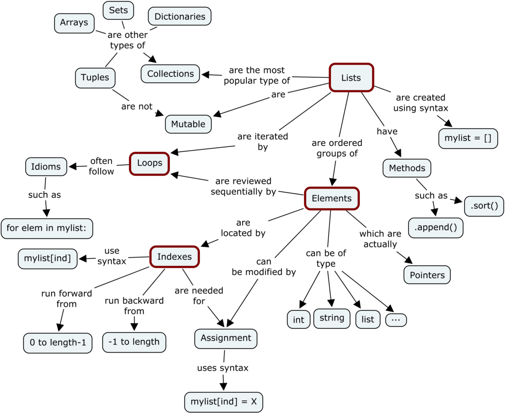
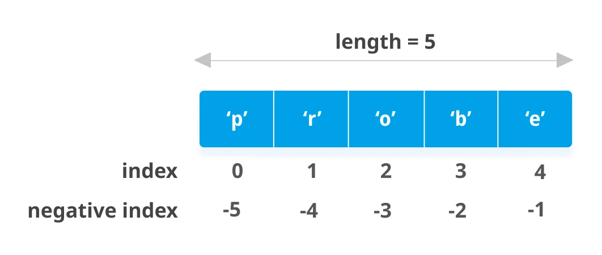
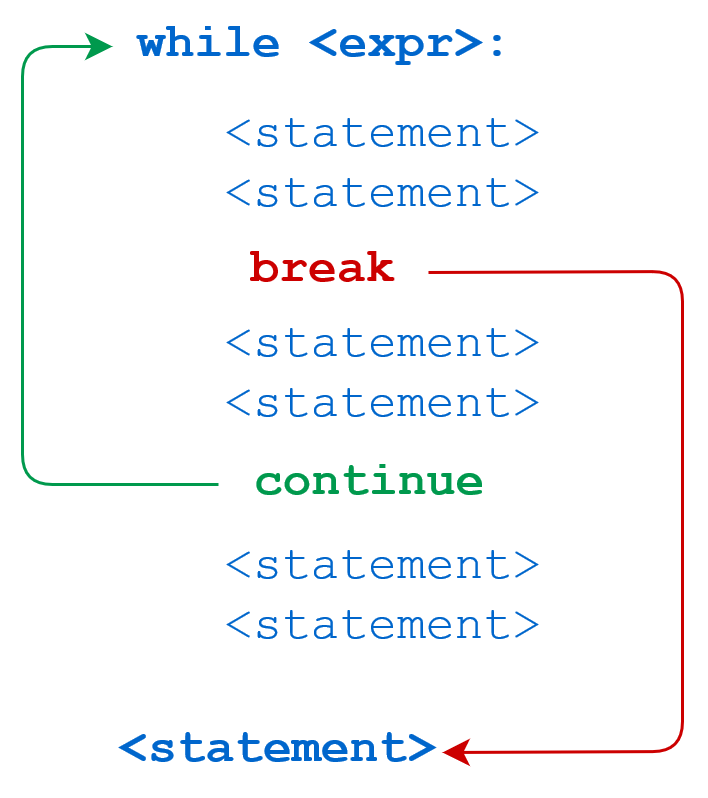

# Session Five: List in Python



List is a Collection elements
Collection of Heterogenous Datatype
Allows duplicate elements
It is mutable (Changeable)
Elements are Ordered in a list

* If we want to represent a group of individual objects as a single entity where insertion order preserved and duplicates are allowed, then we should go for List.

insertion order preserved.
duplicate objects are allowed.
heterogeneous objects are allowed.
List is dynamic because based on our requirement we can increase the size and
decrease the size.
In List the elements will be placed within square brackets and with comma seperator.
We can differentiate duplicate elements by using index and we can preserve insertion
order by using index. Hence index will play very important role.
Python supports both positive and negative indexes. +ve index means from left to
right where as negative index means right to left.


Create Python Lists

Access List Elements

List Index

Negative indexing



List Slicing in Python

Add/Change List Elements

Delete List Elements




# Exercise in List
Find Duplicate Values using Python

```python
def find_duplicates(x):
    length = len(x)
    duplicates = []
    for i in range(length):
        n = i + 1
        for a in range(n, length):
            if x[i] == x[a] and x[i] not in duplicates:
                duplicates.append(x[i])
    return duplicates
names = ["Aman", "Akanksha", "Divyansha", "Devyansh", 
         "Aman", "Diksha", "Akanksha"]
print(find_duplicates(names))
```

Sentence and Word Tokenization using Python


Count Length of a String using Python
```python
# using the builtin function
text = "Aman"
print(len(text))
```

```python
# without using the builtin function
n = 0
text = "Aman"
for i in text:
    n = n+1
print(n)
```

Detect Questions using Python
```python
from nltk.tokenize import word_tokenize
question_words = ["what", "why", "when", "where", 
             "name", "is", "how", "do", "does", 
             "which", "are", "could", "would", 
             "should", "has", "have", "whom", "whose", "don't"]

question = input("Input a sentence: ")
question = question.lower()
question = word_tokenize(question)

if any(x in question[0] for x in question_words):
    print("This is a question!")
else:
    print("This is not a question!")
```

Index of Maximum Value in a Python List

```python
def maximum(x):
    maximum_index = 0
    current_index = 1
    while current_index < len(x):
        if x[current_index] > x[maximum_index]:
            maximum_index = current_index
        current_index = current_index + 1
    return maximum_index
a = [23, 76, 45, 20, 70, 65, 15, 54]
print(maximum(a))
```

Index of Minimum Value in a Python List
```python
def minimum(x):
    minimum_index = 0
    current_index = 1
    while current_index < len(x):
        if x[current_index] < x[minimum_index]:
            minimum_index = current_index
        current_index = current_index + 1
    return minimum_index
a = [23, 76, 45, 20, 70, 65, 15, 54]
print(minimum(a))
```

For Loop Over Keys and Values in a Python Dictionary
```python
age = {"Aman": 23, "Akanksha": 24, "Sajid": 22, "Hardik": 21}
for i in age:
    print(i)
```

```python
for i in age.keys():
    print(i)
```


```python
for i in age.values():
    print(i)
```


```python
for key, value in age.items():
    print(f'Name: {key}, Age: {value}')
```

Swap Items of a Python List
```python
def swap(list_, a, b):
    list_[a], list_[b] = list_[b], list_[a]

names = ["Aman", "Kharwal", "Sajid", "Akanksha"]
print(names)
swap(names, 2, 3)
print(names)
```

Backward For Loop using Python
```python
list_ = ["Aman", "Kharwal", "Akanksha", "Hritika", "Shiwangi"]
for i in list_:
    print(i)
```

```python
for i in reversed(list_):
    print(i)
```

LCM using Python
```python

def least_common_multiple(a, b):
    if a > b:
        greater = a
    elif b > a:
        greater = b
    while(True):
        if ((greater % a == 0) and (greater % b == 0)):
            lcm = greater
            break
        greater = greater + 1
    return lcm

print(least_common_multiple(10, 12))
```

Age Calculator using Python
```python
def ageCalculator(y, m, d):
    import datetime
    today = datetime.datetime.now().date()
    dob = datetime.date(y, m, d)
    age = int((today-dob).days / 365.25)
    print(age)
ageCalculator(1998, 9, 3)
```

Python Program to Count Most Frequent Words in a File
```python
words = []
with open("aman.txt", "r") as f:
    for line in f:
        words.extend(line.split())

from collections import Counter
counts = Counter(words)
top5 = counts.most_common(5)
print(top5)
```

Python Program to Count Capital Letters in a File
```python
with open("text.txt") as file:
    count = 0
    text = file.read()
    for i in text:
        if i.isupper():
            count += 1
    print(count)
```

```python
with open("text.txt") as file:
    count = 0
    text = file.read()
    for i in text:
        if i.islower():
            count += 1
    print(count)
```

Python Program to Remove Spaces
```python
text = "Hi,   My Name is Aman"
new_text = text.replace("  ", "")
print(new_text)
```

Python Program to Remove Odd or Even Numbers From a List
```python
def remove_odd(x):
    for i in x[:]:
        if (i % 2) != 0:
            x.remove(i)
    return x 

x = [12, 15, 7, 9]
print(remove_odd(x))
```


```python
def remove_even(x):
    for i in x[:]:
        if (i % 2) == 0:
            x.remove(i)
    return x
a = [12, 15, 7, 9]
print(remove_even(a))
```


End-to-End Encryption using Python
```python
def is_even(number):
    return number % 2 == 0

def get_even_letters(message):
    even_letters = []
    for counter in range(0, len(message)):
        if is_even(counter):
            even_letters.append(message[counter])
    return even_letters

def get_odd_letters(message):
    odd_letters = []
    for counter in range(0, len(message)):
        if not is_even(counter):
            odd_letters.append(message[counter])
    return odd_letters
```

```python
def swap_letters(message):
    letter_list = []
    if not is_even(len(message)):
        message = message + 'x'
    even_letters = get_even_letters(message)
    odd_letters = get_odd_letters(message)
    for counter in range(0, int(len(message)/2)):
        letter_list.append(odd_letters[counter])
        letter_list.append(even_letters[counter])
    new_message = ''.join(letter_list)
    return new_message
```


```python
import streamlit as st
st.title("End-to-End Encryption")
user = st.text_input("Enter a Message")
st.write(swap_letters(user))
```


Remove Duplicates from a Python List

```python
def remove(items):
    list1 = []
    for i in items:
        if i not in list1:
            list1.append(i)
    return list1

a = ["Aman", "Akanksha", "Aman", "Danish", "Sajid"]
print(remove(a))
```

Sum of Elements of a Python List
```python
a = [24, 25, 20, 30]
print(sum(a))
```

Print a Calendar using Python
```python
import calendar
print(calendar.month(2021, 9))
```


For Loop Over Two Lists in Python
```python
a = "Aman Kharwal"
for i in a:
    print(i)

a = list(range(10))
for i in a:
    print(i)
```

```python
names = ["Aman", "Hritika", "Akanksha"]
age = [22, 21, 24]
index = 0
for i in names:
    print("My Name is ", names[index], "I am ", age[index], "years old")
    index = index + 1
```

Swap Variables using Python
```python
a = 8
b = 10

c = a
a = b
b = c
print("a =", a)
print("b = ", b)
```

```python
a = 8
b = 10
a, b = b, a
print("a = ", a)
print("b = ", b)
```

Password Authentication using Python
```python
import getpass
database = {"aman.kharwal": "123456", "kharwal.aman": "654321"}
username = input("Enter Your Username : ")
password = getpass.getpass("Enter Your Password : ")
for i in database.keys():
    if username == i:
        while password != database.get(i):
            password = getpass.getpass("Enter Your Password Again : ")
        break
print("Verified")
```

Python Program to Print Odd and Even Numbers
```python
for i in range(20):
    if ((i % 2) == 0):
        print(i," is even")
    else:
        print(i," is odd")
````

Pick a Random Card using Python
```python
import random
cards = ["Diamonds", "Spades", "Hearts", "Clubs"]
ranks = [2, 3, 4, 5, 6, 7, 8, 9, 10, "Jack", "Queen", "King", "Ace"]

def pick_a_card():
    card = random.choices(cards)
    rank = random.choices(ranks)
    return(f"The {rank} of {card}")

print(pick_a_card())
```

Remove Unicode Characters using Python
```python
a = "Happy Holi 😀 May this festival of colours bring you happiness, love and joy.🥰 Stay safe everyone Smiling face with smiling eyes"
a = a.encode('ascii', 'ignore').decode()
print(a)
```

Count Character Occurrences using Python
```python
def count_characters(s):
    count = {}
    for i in s:
        if i in count:
            count[i] += 1
        else:
            count[i] = 1
    print(count)
print(count_characters("Thecleverprogrammer"))
```

Create Acronyms using Python
```python
user_input = str(input("Enter a Phrase: "))
text = user_input.split()
a = " "
for i in text:
    a = a+str(i[0]).upper()
print(a)
```


Text-Based Adventure Game with Python
```python
name = str(input("Enter Your Name: "))
print(f"{name} you are stuck at work")
print(" You are still working and suddenly you you saw a ghost, Now you have two options")
print("1.Run. 2.Jump from the window")
user = int(input("Choose 1 or 2: "))
if user == 1:
    print("You did it")
elif user == 2:
    print("You are not that smart")
else:
    print("Please Check your input")
```

Create a Contact Book using Python
```python
names = []
phone_numbers = []
num = 3


for i in range(num):
    name = input("Name: ")
    phone_number = input("Phone Number: ") # for convert to int => int(input("Phone Number: "))

    names.append(name)
    phone_numbers.append(phone_number)

print("\nName\t\t\tPhone Number\n")

for i in range(num):
    print("{}\t\t\t{}".format(names[i], phone_numbers[i]))

search_term = input("\nEnter search term: ")

print("Search result:")

if search_term in names:
    index = names.index(search_term)
    phone_number = phone_numbers[index]
    print("Name: {}, Phone Number: {}".format(search_term, phone_number))

else:
    print("Name Not Found")
```

Palindrome Words using Python
```python
def palindrome(sentence):
    for i in (",.'?/><}{{}}'"):
        sentence = sentence.replace(i, "")
    palindrome = []
    words = sentence.split(' ')
    for word in words:
        word = word.lower()
        if word == word[::-1]:
            palindrome.append(word)
    return palindrome
```

```python
sentence = input("Enter a sentence : ")
print(palindrome(sentence))
```

Format Dates using Python
```python
from datetime import datetime
a = datetime(2021, 10, 2, 0, 0, 0)
b = datetime(2021, 10, 10, 20, 59, 59)
```


```python
output = b-a
print(output)
```

```python
print(output.days)
print(output.total_seconds())
```

```python
string_datetime = datetime(2021, 10, 2, 0, 0, 0)
string_format = '%b %d %Y %H:%M:%S'
string_output = datetime.strftime(string_datetime, string_format)
print(string_output)
```


Python Program to Check Vowel
```python
a = ["a", "e", "i", "o", "u"]
user_input = input("Enter any alphabet : ")
if user_input.lower() in a:
    print("It is a vowel")
else:
    print("It is not a vowel")
```

Dice Roll Simulator with Python
```python
#importing module for random number generation
import random

#range of the values of a dice
min_val = 1
max_val = 6

#to loop the rolling through user input
roll_again = "yes"

#loop
while roll_again == "yes" or roll_again == "y":
    print("Rolling The Dices...")
    print("The Values are :")
    
    #generating and printing 1st random integer from 1 to 6
    print(random.randint(min_val, max_val))
    
    #generating and printing 2nd random integer from 1 to 6
    print(random.randint(min_val, max_val))
    
    #asking user to roll the dice again. Any input other than yes or y will terminate the loop
    roll_again = input("Roll the Dices Again?") 
```

Multiple Inputs with Python using While Loop
```python
while True:
    reply = input("Enter Text: ")
    if reply == 'stop': break
    print(reply)
```

Python Program to Convert Roman Numbers to Decimals
```python
tallies = {
    'I': 1,
    'V': 5,
    'X': 10,
    'L': 50,
    'C': 100,
    'D': 500,
    'M': 1000,
    # specify more numerals if you wish
}

def RomanNumeralToDecimal(romanNumeral):
    sum = 0
    for i in range(len(romanNumeral) - 1):
        left = romanNumeral[i]
        right = romanNumeral[i + 1]
        if tallies[left] < tallies[right]:
            sum -= tallies[left]
        else:
            sum += tallies[left]
    sum += tallies[romanNumeral[-1]]
    return sum
```

