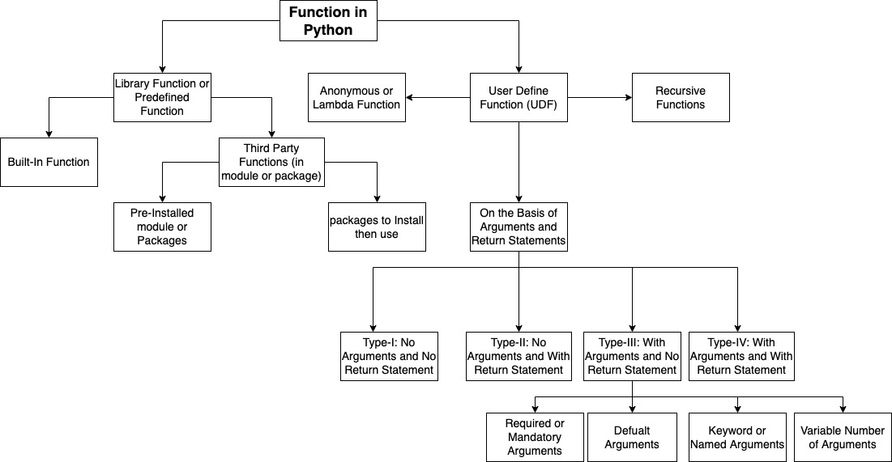

# Session Nine: Functions, Strings
## Function:
* to bundle a set of instructions that you want to use repeatedly.
* Functions can be used to define reusable code and organize and simplify code.
* A function definition consists of the function’s name, parameters, and body.
* Calling a function executes the code in the function.
* A function may be with return statement that does not have to return a value.
* A function’s arguments can be passed as positional arguments or keyword arguments.



<br>


## Types of Functions:

Functions in python can be of Library Functions and User Defined Functions. 

`Library Function`: Which is already developed by somebody else and ready to use. 

Library functions can be further divided into `Built-In Functions` which is preinstalled and directly used in python and `Third-Parth Library Functions` which can not be used directly. 

The Third-Parth Functions can be used by importing module (i.e. through `pre-installed module or package`). 

```python
#in python shell
>>>import math
>>>math.sqrt(16)
4.0

>>>import math as m
>>>m.sqrt(16)
4.0

#in scripting file
import math
print(math.sqrt(16)) #4.0

#import with as keyword
import math as m
print(m.sqrt(16)) #4.0

```

Some modules/packages may not be available with python installation (i.e. `not pre-installed`). These module/package need to be installed before then importing through import statemnet. 

Once package is installed and imported successfully then can be used.

```console
#Installing a python package in Windows through CMD program.
c:\> pip install {package_name}

#Installing a python package in Linus/Ubuntu through Terminal program.
$ pip instal {package_name}

#Installing a python package in MacOS through Terminal program.
% pip install {package_name}
```

## Funcation Types on the Basis of its Arguments and Return Statement

### Defining a function in python
```pyhton
#function definition
def greetings():
    print("Welcome to KLU")
    a = 10
    print("a: ", a)


#calling a function
greetings()
```
Note: If we want to define User Defined Function with no statement then must use `pass` reserved keyword, also called Empty function.

```python
#defining python function with not statements
def calculate1():
    #this is emplty function

#calling calculate1()
calculate1() #Error


#defining Empty function
def calculate():
    pass

#calling calculate()
calculate() # No Error
```

### Type-1: No Argument and No Return Statement

```python
#type-1 No Argument and No Return
def multiply():
    inVal = input("Enter two numbers: ")
    sa, sb = inVal.split()
    a, b = int(sa), int(sb)
    multi = a * b
    print("Multiplication: ", multi)

#calling the multiply()
multiply()
```

### Type-2: No Argument and Wtih Return Statement
```python
#type-2 No Argument and With Return
def multiply1():
    inVal = input("Enter two numbers: ")
    sa, sb = inVal.split()
    a, b = int(sa), int(sb)
    multi = a * b
    return multi

#calling multiply1()
result = multiply1()
print("Multiplication: ", result)

```

### Type-3: Wtih Argument and No Return Statement
```python
#type-3 With Argument and No Return
def multiply2(a, b):
    multi = a * b
    print("Multiplication: ", multi)

#calling multiply2() with int datatype
multiply2(12, 5)

#calling multiply2() with str and int datatype
multiply2("12", 5)

#calling multiply2() with str and str datatype
#multiply2("12", "5")

inVal = input("Enter two numbers: ")
sa, sb = inVal.split()
a, b = int(sa), int(sb)
#calling multiply2()input() from keyboard int datatype
multiply2(a, b)

```

### Type-4: With Argument and With Return Statement
```python
#type-4 With Argument and With Return
def multiply3(a, b):
    print("Id of a:", id(a))
    print("Id of b: ", id(b))

    multi = a*b
    return multi

#calling multiply3()
n = 12
m = 5
print("Outside the function")
print("Id of n: ", id(n))
print("Id of m: ", id(m))
result = multiply3(n, m)
print("Multiplication: ", result)

```
## Function Argument Types
<br>


### 1. Required Arguments 

```python
def fun(a, s, f):
    print("This is int: ", a)
    print("This is str: ", s)
    print("This is float: ", f)

#Calling fun()
fun(12, "hello", 3.1415) #work properly
fun("hello", 3.1415, 12) #may work diffently
fun() #Error: Expected 3 arguments
fun(12, "hello") #Error
fun(12, "hello", 3.1415, 50) #Error
```

```python
def fun(a, s, f):
    print("This is int: ", a)
    print("This is str: ", s)
    print("This is float: ", f)

fun(12, "hello", 3.1415)#work properly
fun("hello", 3.1415, 12)#may work diffently\
fun() #Error Expected 3 arguments
fun(12, "hello") #Error
fun(12, "hello", 3.1415, 50)#Error
```

### 2. Keyword Arguments


### 3. Defual Arguments
```python
def multiply(a=1, b=2):
    print("a: ", a, " b: ", b)
    multi = a * b
    return multi

r1 = multiply(12, 5)
print("Result: ", r1)

r2 = multiply()
print("Result: ", r2)

r3 = multiply(12)
print("Result: ", r3)

r4 = multiply(12, 5, 20)
print("Result: ", r4)

r5 = multiply("12", 5)
print("Result: ", r5)

```

### 4. Variable Number of Arguments

```python
#Defining Function with Variable Number of Arguments
def multiply(*vargs):
    n = len(vargs)
    multi = 1
    for e in vargs:
        multi *= e
    return multi

#calling multiply() with Variable Number of Arguments
r1 = multiply(2, 5, 3)
print("Result: ", r1)
r2 = multiply(10, 20, 4, 5, 6, 15, 7)
print("Result: ", r2)

```


## Exercises in Function Topic

1. Write a program in python to show the simple arithmetic calculations using a function.
```python
Test Data :
Enter First Number: 12
Enter Second Number: 10

Expected Output :
Addition: 22
Subtraction: -2
Multiplication: 120
Division: 1.2
Reminder: 2
```

2. Write a python program in python to find the square of any number using the function. 
```python
Test Data :
Input any number for square : 20
Expected Output :

The square of 20 is : 400.00
```
3. Write a program in python to swap two numbers using function. 

```python
Test Data :
Input 1st number : 2
Input 2nd number : 4
Expected Output :

Before swapping: n1 = 2, n2 = 4                                                  
After swapping: n1 = 4, n2 = 2 
```
4. Write a program in python to check a given number is even or odd using the function. 

```python
Test Data :
Input any number : 5
Expected Output :

 The entered number is odd.  
```
5. Write a program in puhton to find the sum of the series 1!/1+2!/2+3!/3+4!/4+5!/5 using the function. 
```python
Expected Output :

 The sum of the series is : 34 
```
6. Write a program in python to convert decimal number to binary number using the function.
```python
Test Data :
Input any decimal number : 65
Expected Output :

 The Binary value is : 1000001 
 
```
7. Write a program in python to check whether a number is a prime number or not using the function. 
```python
Test Data :
Input a positive number : 5
Expected Output :

The number 5 is a prime number. 
```
8. Write a program in python to get the largest element of an array using the function. 
```python
Test Data :
Input the number of elements to be stored in the array :5
Input 5 elements in the array :
element - 0 : 1
element - 1 : 2
element - 2 : 3
element - 3 : 4
element - 4 : 5
Expected Output :

The largest element in the array is : 5   
```
9. Write a program in python to check armstrong and perfect numbers using the function. 
```python
Test Data :
Input any number: 371
Expected Output :

 The 371 is an Armstrong number.                                                 
 The 371 is not a Perfect number.  
```
10. Write a program in python to print all perfect numbers in given range using the function. 
```python
Test Data :
Input lowest search limit of perfect numbers : 1
Input lowest search limit of perfect numbers : 100
Expected Output :

 The perfect numbers between 1 to 100 are :                                      
 6   28  
 
```
11. Write a program in python to check whether two given strings are an anagram. 
```python
Test Data :
Input the first String : spare
Input the second String : pears
Expected Output :

 spare and pears are Anagram.    
```
12. Write a python programming to find out maximum and minimum of some values using function of a given list of integers. 
```python
Test Data :
Input 5 values
25
11
35
65
20
Expected Output :

Number of values you want to input: Input 5 values
Minimum value is: 11
Maximum value is: 65 
```

13. Complete the function definition of the given code below:
```python
#returns the max value between a, b
def manValue(a, b):
    pass

#calling 
print("Max Value: ", maxValue(12, 15)) #15
```

14. Complete the function definition of the given code below:
```python
#returns the min value between a, b
def minValue(a, b):
    pass

#calling 
print("Min Value: ", minValue(12, 15)) #12
```
