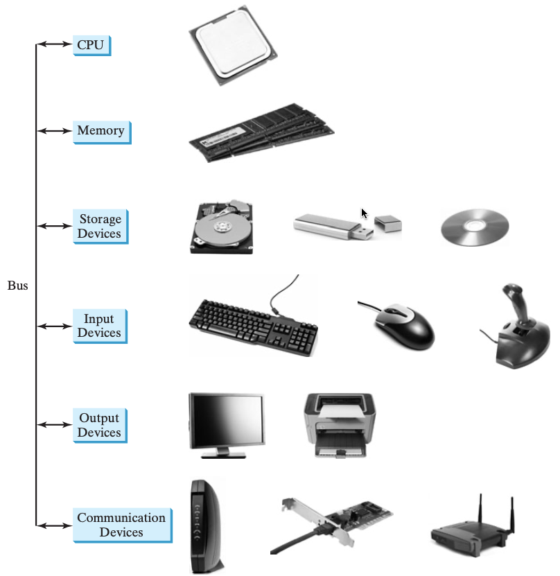
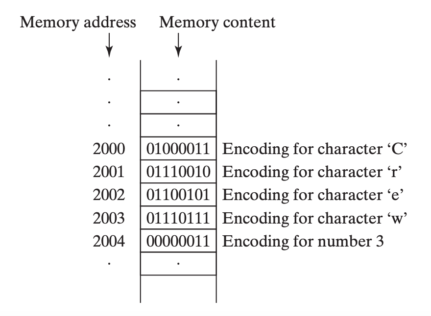
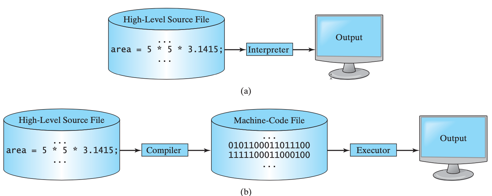

# Session One

# Introduction to Course Handout

# Basics of Computer
`Definition`: Computer is an electronic device which takes some input through Input Devices and gives output through Output Devices after perform the given tasks in the form of instruction. In short a computer is an electronic device that stores and processes data. A computer includes both hardware and software.

## Hardware and Software 
All the physical components in the computer are called Hardware Devices which can be touched and made of material. There are different hardware devices Ex. Monitor, Keyboard, Mouse, Projector, Printer etc these all are physical component by nature. 

In general, hardware comprises the visible, physical elements of the computer, and software provides the invisible instructions that control the hardware and make it perform specific tasks. 

Knowing computer hardware helps you better understand the effects that a program’s instructions have on the computer and its components.

Hardware Devides can be broadly categorised into the following categories:

1. `A central processing unit (CPU)`: The **central processing unit (CPU)** is the computer’s **brain**. It retrieves **instructions** from memory and executes them. The CPU usually has two components: a **control unit (CU)** and an **arithmetic and logical unit (ALU)**. The control unit **controls and coordinates** the actions of the other components. The arithmetic/logic unit performs **numeric operations** (addition, subtraction, multiplication, division) and **logical operations** (comparisons).

2. `Memory (main memory)`: Before we discuss **memory**, let’s look at how **information (data and programs)** are stored in a computer. A computer is really nothing more than a series of switches. Where each switch exists in two states: on or off. Storing information in a computer is simply a matter of setting a sequence of switches on or off. If the switch is on, its value is 1. If the switch is off, its value is 0. These 0s and 1s are interpreted as digits in the binary number system and called bits (binary digits). The **minimum storage unit** in a computer is a byte. A **byte** is composed of eight bits. A small number such as 3 can be stored as a single byte. To store a number that cannot fit into a single byte, the computer uses several bytes.
* Smallest Unit of momory is 1 bit and 
* A nibble = 4 bits
* A byte = 8 bits or 2 nibbles
* A kilobyte (KB) = 1024 bytes.
* A megabyte (MB) = 1024 KB.
* A gigabyte (GB) = 1024 MB.
* A terabyte (TB) = 1024 GB.
A typical one-page word document might take 20 KB. So 1 MB can store 50 pages of documents and 1 GB can store 50000 pages of documents. A typical two-hour high-resolution movie might take 8 GB. So it would require 160 GB to store 20 movies.
A computer’s memory consists of an ordered sequence of bytes for storing programs as well as data that the program is working with.
A program and its data must be moved into the computer’s memory before they can be executed by the CPU. 
Every byte in the memory has a unique address. The address is used to locate the byte for storing and retrieving the data. Since the bytes in the memory can be accessed in any order, the memory is also referred to as random-access memory (RAM).

3. `Storage devices (such as disks and CDs)`:
■ Magnetic disk drives
■ Optical disc drives (CD and DVD)
■ USB flash drives

4. `Communication devices (such as modems and network interface cards)`

1. `Input Devices`: Those all hardware devices which are used to take some input to the computer are called Input Devices Ex. Keyboard, Mic, WebCamera, Digital Pen, Scanner etc.

2. `Output Devices`: Those all hardware devices which produces some output from computer are called Output Devices Ex. Monitor, Speaker, Printer, Projector etc.

3. `Storage Devices`: Those all hardware devices which are used to store data called storage devices Ex. Pendrive, Hard Drive, CD, DVD etc.

4. `Processing Device`: Processor is hardware divice which is used for computation/processing also called brain of computer.

`Note`: A computer’s components are interconnected by a subsystem called a bus..

## Software Types
Software is non-physical part of computer which makes computer function and perform task which we want the computer to do. It is a piece or collection of codes/instructions which collectively do a particular task. Software can be for functioning or managing Computer Hardware as well as for the purpose of User. The Software used for computer purposes called System Software and the software used for user purposes is called Application Software. System Software can further be categoried as Operating Software (OS) and Utility Software. The Operating Software is the software which makes our Computer devices and other software function well. 
`Note`: These software is created by using some Computer programming.

# Basics of Computer Programming

## What is a Program?
Software contains the instructions that tell a computer—or a computerized device—what to do? If we want to tell the computer to do some task, we tell by giving instruction also called the smallest unit of software. Programm is a collection of instruction to perform a particular task. 

## What is Programming Language?
**Software developers** create software with the help of powerful tools called **programming languages**. In other word, if we want to give some instructions to the computer to do some taks, we need to communicate to the computer so need of language comes into picture. **Language** is a medium using which two entities communicate to each other. Programing Language is the medium for communicating to computer, where entities can be Human to computer and computer to computer as well. There are differnt types of programming language as follows:
1. **Low Level Language or Machine Language**: The language represented by 0s and 1s and direclty understood by computer is called Low Level or Machine language. 

2. **Assembly Language or Symbolic Language or Mnemobic Language**: The language written in the form of symbols.

3. **High Level Langauge** 

4. **Artificial Intelligence Language**

## What is Programming Language Translator
We give instruction to the computer through some programming language. Since computer unerstand the language represented by sequence of zeros and ones (0s and 1s) and we as human strugle learning this language we need to have something who knows both the language i.e. the language known by computer and the language known by human. The thing who knows both the language can be thought as language translator. The language translastors translates one language (source language) to other language (destination language). There are different types of programing language translators.

Types of Translator in Programming Language
1. Assembler 
2. Interpreter
3. Compiler

Interpreted vs Compiled Programming Language

Computer Programming Paradigm

# The History of Python
Python is a **general-purpose**, **interpreted**, **object-oriented programming language**.

Python was created by Guido van Rossum in the Netherlands in 1990 and was named after the popular British comedy troupe Monty Python’s Flying Circus.

 `(a)` An interpreter translates and executes a program one statement at a time. `(b)` A compiler translates the entire source program into a machine-language file for execution.

 Data in Python are **objects** created from **classes**. A class is essentially a **type** or **category** that defines objects of the same kind with **properties** and **methods** for manipulating objects. Object-oriented programming is a powerful tool for developing **reusable software**. 

 A Python program is executed from the Python interpreter.

# Interactive Mode vs Scripting Mode in Python
Assume you have Python installed on the Windows OS. You can start Python in a command window by typing python at the command prompt. This way of launching python is called **Interactive Mode**. 
Other way to open python is called scripting mode by launching IDLE. **IDLE (Interactive DeveLopment Environment)** is an integrated development environment (IDE) for Python. You can create, open, save, edit, and run Python programs in IDLE. Both the command-line Python interpreter and IDLE are available after Python is installed on your machine.

